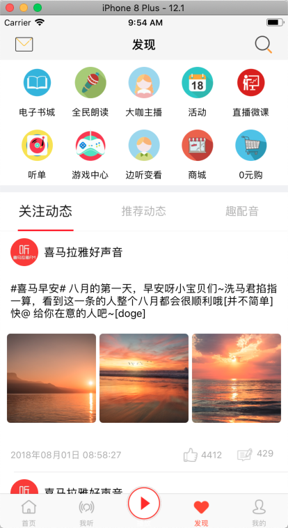
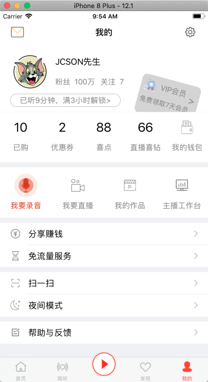

# LBXMLYFM-Swift
Swift5项目仿写喜马拉雅App，采用MVC+MVVM设计模式，Moya+SwiftyJSON+HandyJSON网络框架和数据解析。数据来源抓包及部分本地json文件

Swift5 精仿漫画类App[Swift5 精仿漫画类App](https://github.com/lb2281075105/LBU25-Swift.git)
# 注意
Swift5 喜马拉雅项目 在xcode10.1以上版本才能运行成功

喜马拉雅App:主要分为 首页 我听 发现 我的 四个大模块,详情可以查看截图

如有侵权,造成影响,请联系本人删除,谢谢
